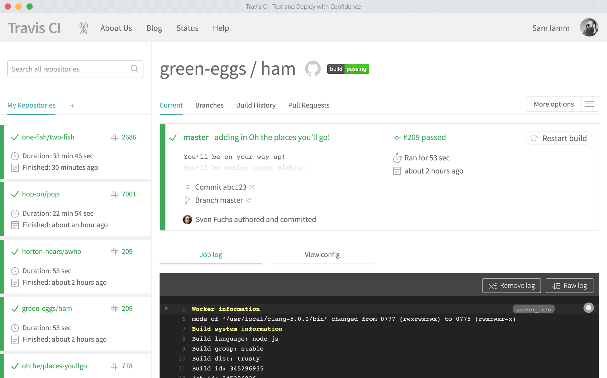
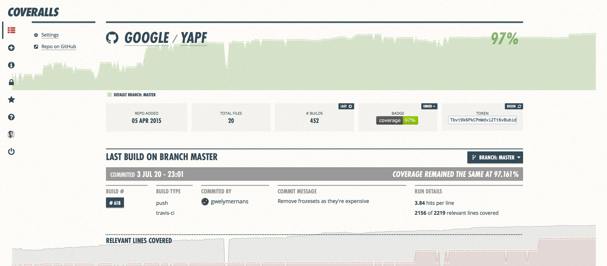
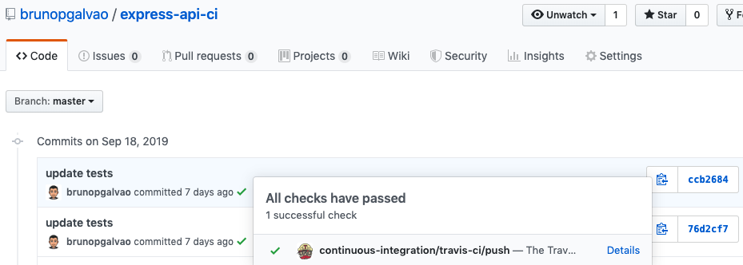
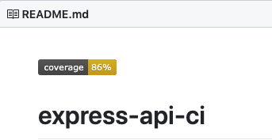

#   SOFTWARE ENGINEERING IMMERSIVE

[](https://coveralls.io/github/JordanCruzCorrea/express-api-ci?branch=master)

## Getting started

1. Create a repo on GitHub.com called express-api-ci.
2. Clone it down and follow the instructions on this readme.
3. Your repo needs to be public and on GitHub.com so [Travis CI](https://travis-ci.org) can read it.

# Express API - Continuous Integration

What is Continuous Integration? Let's take 10min to read:

> Contemplate: What is CI? Why is it important? Should I used it?

- https://www.atlassian.com/continuous-delivery/continuous-integration
- https://www.thoughtworks.com/continuous-integration
- https://martinfowler.com/articles/continuousIntegration.html

We are going to hit the ground running with this lesson. Up until this point you have created an express json api full crud (even a bit of unit testing). So let's skip the basics and dive right in!

Make sure you're inside the GitHub.com repo you created:

```sh
git clone https://github.com/yourusername/express-api-ci
cd express-api-ci
```

We will now create our directory structure (quickly).

Copy this entire code snippet and paste it into your terminal and hit return:

```sh
npm init -y && 
npm install sequelize pg express body-parser morgan faker && 
npm install --save-dev nodemon jest supertest cross-env sequelize-cli && 
npx sequelize-cli init &&
echo "
/node_modules
.DS_Store
.env" >> .gitignore &&
mkdir routes controllers tests &&
touch server.js  routes/index.js controllers/index.js tests/{base.test.js,routes.test.js} &&
code .
```

Let's setup our database configuration:

express-api-ci/config/config.json
```js
{
  "development": {
    "database": "express_api_ci_development",
    "dialect": "postgres"
  },
  "test": {
    "database": "express_api_ci_test",
    "dialect": "postgres"
  },
  "production": {
    "use_env_variable": "DATABASE_URL",
    "dialect": "postgres",
    "dialectOptions": {
      "ssl": true
    }
  }
}
```

> Notice: For production we use `use_env_variable` and `DATABASE_URL`. We are going to deploy this app to [Heroku](https://www.heroku.com). Heroku is smart enough to replace `DATABASE_URL` with the production database. You will see this at the end of the lesson.

Create your database, a User model, and run the migration:

```sh
npx sequelize-cli db:create
npx sequelize-cli model:generate --name User --attributes firstName:string,lastName:string,email:string,userName:string,password:string,jobTitle:string
npx sequelize-cli db:migrate
```

Create the seed:

```sh
npx sequelize-cli seed:generate --name users
```

Edit the seed file:

```js
const faker = require('faker');

const users = [...Array(50)].map((user) => (
  {
    firstName: faker.name.firstName(),
    lastName: faker.name.lastName(),
    email: faker.internet.email(),
    userName: faker.internet.userName(),
    password: faker.internet.password(8),
    jobTitle: faker.name.jobTitle(),
    createdAt: new Date(),
    updatedAt: new Date()
  }
))

module.exports = {
  up: (queryInterface, Sequelize) => {
    return queryInterface.bulkInsert('Users', users, {});
  },

  down: (queryInterface, Sequelize) => {
    return queryInterface.bulkDelete('Users', null, {});
  }
};
```

Execute the seed file:

```sh
npx sequelize-cli db:seed:all
```

Create the Project model:

```sh
npx sequelize-cli model:generate --name Project --attributes title:string,imageUrl:string,description:text,githubUrl:string,deployedUrl:string,userId:integer
```

project.js
```js
module.exports = (sequelize, DataTypes) => {
  const Project = sequelize.define('Project', {
    title: DataTypes.STRING,
    imageUrl: DataTypes.STRING,
    description: DataTypes.STRING,
    githubUrl: DataTypes.STRING,
    deployedUrl: DataTypes.STRING,
    userId: {
      type: DataTypes.INTEGER,
      references: {
        model: 'User',
        key: 'id',
        as: 'userId',
      }
    }
  }, {});
  Project.associate = function (models) {
    // associations can be defined here
    Project.belongsTo(models.User, {
      foreignKey: 'userId',
      onDelete: 'CASCADE'
    })
  };
  return Project;
};
```

user.js
```js
module.exports = (sequelize, DataTypes) => {
  const User = sequelize.define('User', {
    firstName: DataTypes.STRING,
    lastName: DataTypes.STRING,
    email: DataTypes.STRING
  }, {});
  User.associate = function(models) {
    // associations can be defined here
    User.hasMany(models.Project, {
      foreignKey: 'userId'
    })
  };
  return User;
};
```

Run the migrations:

```js
npx sequelize-cli db:migrate
```

Let's create a seed for projects:

```sh
npx sequelize-cli seed:generate --name projects
```

We will be using the faker package:

seeders/20190915023333-projects.js
```js
const faker = require('faker');

const projects = [...Array(500)].map((project) => (
  {
    title: faker.commerce.productName(),
    imageUrl: faker.image.business(),
    description: faker.lorem.paragraph(),
    githubUrl: faker.internet.url(),
    deployedUrl: faker.internet.url(),
    userId: Math.floor(Math.random() * 100) + 1,
    createdAt: new Date(),
    updatedAt: new Date()
  }
))

module.exports = {
  up: (queryInterface, Sequelize) => {
    return queryInterface.bulkInsert('Projects', projects, {});
  },

  down: (queryInterface, Sequelize) => {
    return queryInterface.bulkDelete('Projects', null, {});
  }
};
```

Run the seed file, replace the timestamp below with your timestamp:

```sh
npx sequelize-cli db:seed --seed 20190915023333-projects.js
```

Make sure the data came through on [Postico](https://eggerapps.at/postico).

Modify your package.json:

```js
  "scripts": {
    "test": "cross-env NODE_ENV=test jest --testTimeout=10000",
    "pretest": "cross-env NODE_ENV=test npm run db:reset",
    "db:create:test": "cross-env NODE_ENV=test npx sequelize-cli db:create",
    "start": "nodemon server.js",
    "db:reset": "npx sequelize-cli db:drop && npx sequelize-cli db:create && npx sequelize-cli db:migrate && npx sequelize-cli db:seed:all"
  },
  "jest": {
    "testEnvironment": "node",
    "coveragePathIgnorePatterns": [
      "/node_modules/"
    ]
  }
```

Create your routes:

routes/index.js
```js
const { Router } = require('express');
const controllers = require('../controllers')
const router = Router();

router.get('/', (req, res) => res.send('This is root!'))

router.post('/users', controllers.createUser)
router.get('/users', controllers.getAllUsers)
router.get('/users/:id', controllers.getUserById)
router.put('/users/:id', controllers.updateUser)
router.delete('/users/:id', controllers.deleteUser)

module.exports = router;
```

We will be creating an app.js which will hold our backend application logic and a server.js file which will create an instantiation of our backend application.

First let's create app.js

```js
const express = require('express');
const bodyParser = require('body-parser');
const logger = require('morgan');
const routes = require('./routes');

const app = express();

app.use(bodyParser.json())
app.use(logger('dev'))

app.use('/api', routes);

module.exports = app
```

Next let's create server.js

```js
const app = require('./app.js');

const PORT = process.env.PORT || 3000;

app.listen(PORT, () => console.log(`Listening on port: ${PORT}`))
```

Create the controllers:

controllers/index.js
```js
const { User, Project } = require('../models');

const createUser = async (req, res) => {
    try {
        const user = await User.create(req.body);
        return res.status(201).json({
            user,
        });
    } catch (error) {
        return res.status(500).json({ error: error.message })
    }
}

const getAllUsers = async (req, res) => {
    try {
        const users = await User.findAll({
            include: [
                {
                    model: Project
                }
            ]
        });
        return res.status(200).json({ users });
    } catch (error) {
        return res.status(500).send(error.message);
    }
}

const getUserById = async (req, res) => {
    try {
        const { id } = req.params;
        const user = await User.findOne({
            where: { id: id },
            include: [
                {
                    model: Project
                }
            ]
        });
        if (user) {
            return res.status(200).json({ user });
        }
        return res.status(404).send('User with the specified ID does not exists');
    } catch (error) {
        return res.status(500).send(error.message);
    }
}

const updateUser = async (req, res) => {
    try {
        const { id } = req.params;
        const [updated] = await User.update(req.body, {
            where: { id: id }
        });
        if (updated) {
            const updatedUser = await User.findOne({ where: { id: id } });
            return res.status(200).json({ user: updatedUser });
        }
        throw new Error('User not found');
    } catch (error) {
        return res.status(500).send(error.message);
    }
};

const deleteUser = async (req, res) => {
    try {
        const { id } = req.params;
        const deleted = await User.destroy({
            where: { id: id }
        });
        if (deleted) {
            return res.status(200).send("User deleted");
        }
        throw new Error("User not found");
    } catch (error) {
        return res.status(500).send(error.message);
    }
};

module.exports = {
    createUser,
    getAllUsers,
    getUserById,
    updateUser,
    deleteUser
}
```

Run the server:

```sh
npm start
```

Create your base test:

tests/base.test.js
```js
describe('Initial Test', () => {
    it('should test that 1 + 1 === 2', () => {
        expect(1 + 1).toBe(2)
    })
})
```

And finally our routes tests:

tests/routes.test.js
```js
const request = require('supertest')
const app = require('../app.js')
describe('User API', () => {
    it('should show all users', async () => {
        const res = await request(app).get('/api/users')
        expect(res.statusCode).toEqual(200)
        expect(res.body).toHaveProperty('users')
    }),
        it('should show a user', async () => {
            const res = await request(app).get('/api/users/3')
            expect(res.statusCode).toEqual(200)
            expect(res.body).toHaveProperty('user')
        }),
        it('should create a new user', async () => {
            const res = await request(app)
                .post('/api/users')
                .send({
                    firstName: 'Bob',
                    lastName: 'Doe',
                    email: 'bob@doe.com',
                    password: '12345678'
                })
            expect(res.statusCode).toEqual(201)
            expect(res.body).toHaveProperty('user')
        }),
        it('should update a user', async () => {
            const res = await request(app)
                .put('/api/users/3')
                .send({
                    firstName: 'Bob',
                    lastName: 'Smith',
                    email: 'bob@doe.com',
                    password: 'abc123'
                })
            expect(res.statusCode).toEqual(200)
            expect(res.body).toHaveProperty('user')
        }),
        it('should delete a user', async () => {
            const res = await request(app)
                .del('/api/users/3')
                .send({
                    firstName: 'Bob',
                    lastName: 'Smith',
                    email: 'bob@doe.com',
                    password: 'abc123'
                })
            expect(res.statusCode).toEqual(200)
            expect(res.text).toEqual("User deleted")
        })
})
```

Test it!

```sh
npm run db:create:test && npm test
```

## Continuous Integration

We will now setup Continuous Integration (CI). The idea is that anytime we push changes to GitHub, it will kickoff a build of our project on Travis CI with the latest changes. Travis CI will run our tests and either pass or fail the tests. Additionally, we will integrate [Coveralls](https://coveralls.io) to check test coverage on our codebase - the idea is that all new features we push up to GitHub should be paired with a Unit Test.

Ok enough words, let's start by integrating [Travis CI](https://travis-ci.org).

### Integrating Travis CI



##

1. First you will need to signup at [Travis CI](https://travis-ci.org).

2. Make sure you have pushed all changes up to GitHub.

3. Once you've created an account with Travis CI, add your repo.

4. Activate your repo.

Now we need to setup the [Travis CI](https://travis-ci.org) config file:

```sh
touch .travis.yml
```

Add the following to .travis.yml:

```yml
language: node_js
node_js:
  - 'stable'
install: npm install
services:
  - postgresql
before_script:
  - npm run db:create:test
script: npm test
after_success: npm run coverage
```

> This tells [Travis CI](https://travis-ci.org) what to do. You can see in this config that we're telling [Travis CI](https://travis-ci.org) to runs tests, if the test succeed, then run [Coveralls](https://coveralls.io)

### Integrating Coveralls



##

Before we can run [Travis CI](https://travis-ci.org) we need to setup [Coveralls](https://coveralls.io) so let's do that:

```sh
touch .coveralls.yml
```

1. Go to the [Coveralls](https://coveralls.io) website and sign up.

2. Add your repo. 

3. Click on your repo inside the coveralls website. Copy the repo_token. Paste it inside of .coveralls.yml

4. Scroll to the bottom of the coveralls website on your repo page, copy the markdown for the coveralls badge. Paste on line 1 of your readme.

Change your package.json:

```js
  "scripts": {
    "test": "cross-env NODE_ENV=test jest  --testTimeout=10000 --detectOpenHandles --forceExit",
    "pretest": "cross-env NODE_ENV=test npm run db:reset",
    "db:create:test": "cross-env NODE_ENV=test npx sequelize-cli db:create",
    "start": "node server.js",
    "dev": "nodemon server.js",
    "db:reset": "npx sequelize-cli db:drop && npx sequelize-cli db:create && npx sequelize-cli db:migrate && npx sequelize-cli db:seed:all",
    "coverage": "npm run db:create:test && npm run pretest && jest --coverage && cat ./coverage/lcov.info | coveralls"
  },
```

Finally, you can now push changes up and it will kick off a Travis CI build.

Check for a successful build.



##

You will also see your Coveralls badge in your README.md updated.



##

### Adding Deployment to the Travis CI Build

So we get all the tests to pass. Then what? Well that means the app is ready for production - its ready to deploy. Let's have Travis CI kickoff a Heroku deployment if all tests pass.

> Make sure you're on the `master` branch!

1. `heroku create your-heroku-app-name`
2. `heroku buildpacks:set heroku/nodejs`
3. `heroku addons:create heroku-postgresql:hobby-dev --app=your-heroku-app-name`

Now let's configure Travis CI to do the deployment upon our test successfully passing.

First, we have to install the [Travis CI CLI](https://github.com/travis-ci/travis.rb#readme) tool:

```sh
gem install travis -v 1.8.10
```

We are going to use the Travis CLI to setup our Travis Heroku config:

```sh
travis setup heroku
```

> Make sure you encrypt your heroku api key! More info on running heroku commands on travis [here](https://docs.travis-ci.com/user/deployment/heroku/#running-commands)


Ok, our .travis.yml file should now look something like this:

```yml
language: node_js
node_js:
- stable
install: npm install
services:
- postgresql
before_script:
- npm run db:create:test
script: npm test
after_success: npm run coverage
deploy:
  provider: heroku
  api_key:
    secure: your-heroku-encrypted-api-key
  app: your-heroku-app-name
  on:
    repo: your-github-usernam/your-repo
  run:
    - "npx sequelize-cli db:migrate"
    - "npx sequelize-cli db:seed:all"
```

```sh
git status
git commit -am "add heroku deployment to travis build"
git push
```

And watch the Travis build for:

1. Successful tests.
1. Successful Heroku deployment.
1. Successful Sequelize migrations on Heroku.
1. Successful Sequelize seeding on Heroku.

Once the build is complete, test the endpoints on Heroku to confirm: 

- https://your-heroku-app-name.herokuapp.com/api/users
- https://your-heroku-app-name.herokuapp.com/api/users/1

**Excellent!**

> ✊ **Fist to Five**

## Feedback

> [Take a minute to give us feedback on this lesson so we can improve it!](https://forms.gle/vgUoXbzxPWf4oPCX6)
